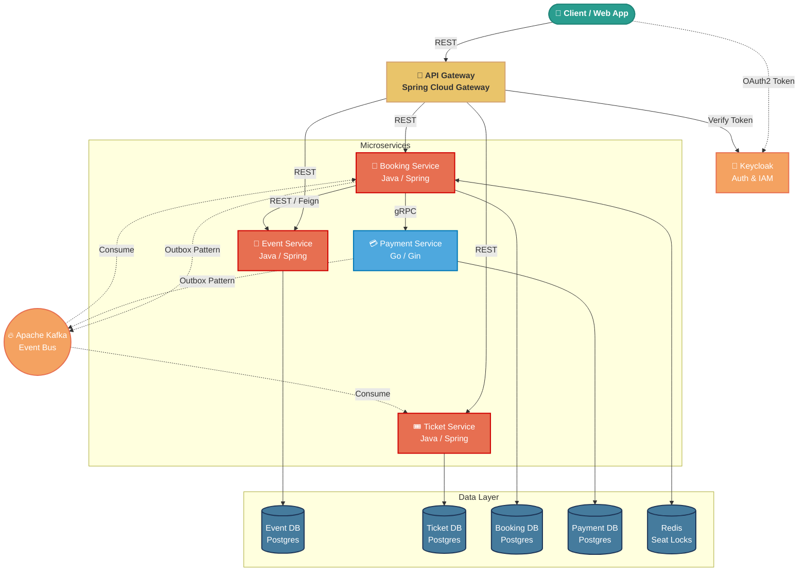
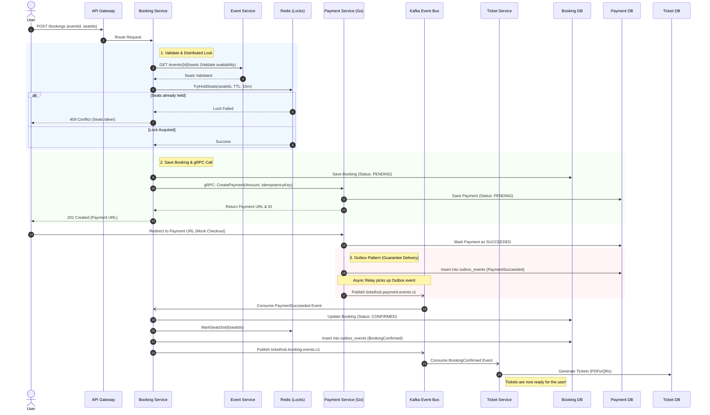

<div align="center">
  <h1>🎟️ Tickethub Platform</h1>
  <p><b>A modern, scalable, and fully observable microservices platform for event management and ticket booking.</b></p>

  <!-- Tech Stack Badges -->
  
  
  
  
  
  
  <br/>
  
  
  
  
</div>

<br/>

## 🏗️ System Architecture

The platform is designed around strict microservice boundaries. Each service owns its data, and they communicate via synchronous **gRPC/REST** for critical paths, and asynchronous **Kafka** events for eventual consistency.



---

## 🔄 Core Business Flow (Booking & Payment)

The most complex part of the system is guaranteeing that a user doesn't double-book a seat, and ensuring that a successful payment *always* generates a ticket. We achieve this using **Distributed Redis Locks** and the **Transactional Outbox Pattern**.



---

## ✨ Key Architectural Patterns

* **Polyglot Ecosystem:** Core services are written in **Java (Spring Boot)** for rapid domain modeling, while the `payment-service` is written in **Go** to handle high-throughput, low-latency financial transactions.
* **Transactional Outbox:** Instead of dual-writing to the database and Kafka (which causes race conditions), services write events to an `outbox_events` table in the same ACID transaction as the business entity. A background relay then pushes these events to Kafka ensuring exactly-once/at-least-once delivery.
* **Distributed Locking:** Redis is used via `SeatHoldService` to prevent double-booking of seats across multiple instances of the booking service.
* **Full Observability (PLG + OTel):** 
  * 📈 **Prometheus & Grafana:** Hardware and application metrics (Micrometer/Go metrics).
  * 🕵️ **Jaeger (OpenTelemetry):** Distributed tracing across Java and Go boundaries via gRPC metadata and HTTP headers.
  * 📜 **Loki & Promtail:** Centralized logging with Trace ID injection (Log Correlation).

---

## 🚦 Getting Started

### Prerequisites
* Docker & Docker Compose
* Ports `8080`, `8180`, `3000`, `9091`, and `16686` must be free.

### Running the Platform

1. **Clone the repository:**
   ```bash
   git clone https://github.com/nurassul/tickethub-platform.git
   cd tickethub-platform
   ```

2. **Start the infrastructure and services:**
   ```bash
   # Add --build to compile the latest Java/Go code
   docker-compose up -d --build
   ```

3. **Access the UIs:**
   * **API Gateway:** `http://localhost:8080`
   * **Grafana (Metrics & Logs):** `http://localhost:3000` *(Login: admin / admin)*
   * **Jaeger (Distributed Tracing):** `http://localhost:16686`
   * **Prometheus:** `http://localhost:9091`

## 📁 Directory Structure
```text
tickethub-platform/
├── api-gateway/       # Spring Cloud Gateway (Entrypoint)
├── booking-service/   # Java 21 / Spring Boot (Booking Domain)
├── event-service/     # Java 21 / Spring Boot (Events & Seats Domain)
├── payment-service/   # Go 1.21 / Gin / gRPC (Payment Domain)
├── ticket-service/    # Java 21 / Spring Boot (Ticket Generation)
├── contracts/         # gRPC Protobuf definitions (.proto)
├── db-init/           # PostgreSQL initialization scripts
├── prometheus/        # Observability configurations
└── docker-compose.yml # Main infrastructure file
```
