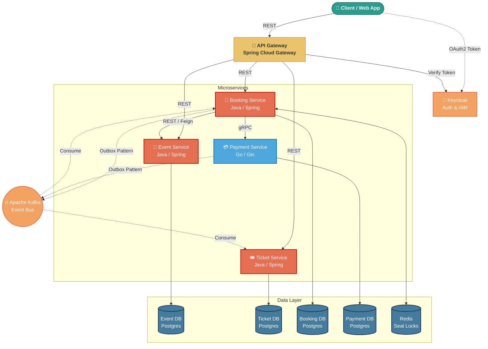

# 🏗️ System Architecture

This diagram illustrates the high-level architecture of the Tickethub platform.

## Key Architectural Decisions

1. **API Gateway:** Acts as the single entry point, routing requests and validating Keycloak JWT tokens.
2. **Polyglot Services:** Core business logic is in Java, but Payment processing uses Go for high performance and low memory footprint.
3. **Database per Service:** Strict microservice boundaries. No service can directly query another service's database.
4. **gRPC:** Used for synchronous, low-latency communication between Booking and Payment services.
5. **Event-Driven & Outbox Pattern:** Services communicate state changes asynchronously via Kafka. The Transactional Outbox pattern ensures local DB commits and Kafka events are strictly atomically consistent.
