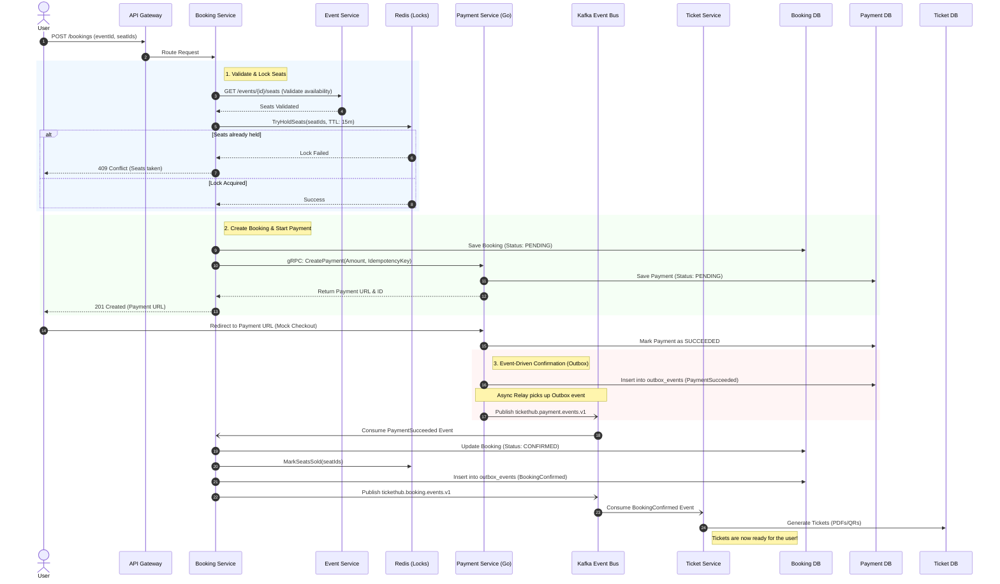

# 🔄 Booking & Payment Flow

This sequence diagram explains the lifecycle of a ticket purchase, demonstrating distributed locks, synchronous gRPC calls, and asynchronous Kafka events.

```mermaid
sequenceDiagram
    autonumber
    
    actor User
    participant Gateway as API Gateway
    participant Booking as Booking Service
    participant Event as Event Service
    participant Redis as Redis (Locks)
    participant Payment as Payment Service (Go)
    participant Kafka as Kafka Event Bus
    participant Ticket as Ticket Service

    User->>Gateway: POST /bookings (eventId, seatIds)
    Gateway->>Booking: Route Request
    
    %% Validation & Locking
    rect rgb(240, 248, 255)
        Note right of Booking: 1. Validate & Lock Seats
        Booking->>Event: GET /events/{id}/seats (Validate availability)
        Event-->>Booking: Seats Validated
        Booking->>Redis: TryHoldSeats(seatIds, TTL: 15m)
        alt Seats already held
            Redis-->>Booking: Lock Failed
            Booking-->>User: 409 Conflict (Seats taken)
        else Lock Acquired
            Redis-->>Booking: Success
        end
    end

    %% Booking Creation
    rect rgb(245, 255, 245)
        Note right of Booking: 2. Create Booking & Start Payment
        Booking->>Booking DB: Save Booking (Status: PENDING)
        Booking->>Payment: gRPC: CreatePayment(Amount, IdempotencyKey)
        Payment->>Payment DB: Save Payment (Status: PENDING)
        Payment-->>Booking: Return Payment URL & ID
        Booking-->>User: 201 Created (Payment URL)
    end

    %% Payment Processing (Async)
    User->>Payment: Redirect to Payment URL (Mock Checkout)
    Payment->>Payment DB: Mark Payment as SUCCEEDED
    
    rect rgb(255, 245, 245)
        Note right of Payment: 3. Event-Driven Confirmation (Outbox)
        Payment->>Payment DB: Insert into outbox_events (PaymentSucceeded)
        Note over Payment,Kafka: Async Relay picks up Outbox event
        Payment-)Kafka: Publish tickethub.payment.events.v1
    end

    %% Async Resolution
    Kafka-)Booking: Consume PaymentSucceeded Event
    Booking->>Booking DB: Update Booking (Status: CONFIRMED)
    Booking->>Redis: MarkSeatsSold(seatIds)
    Booking->>Booking DB: Insert into outbox_events (BookingConfirmed)
    Booking-)Kafka: Publish tickethub.booking.events.v1

    Kafka-)Ticket: Consume BookingConfirmed Event
    Ticket->>Ticket DB: Generate Tickets (PDFs/QRs)
    Note right of Ticket: Tickets are now ready for the user!
```
